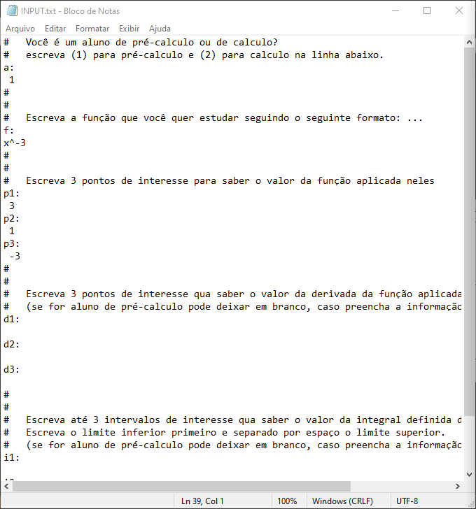
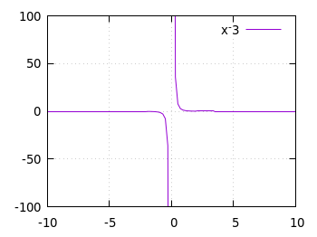
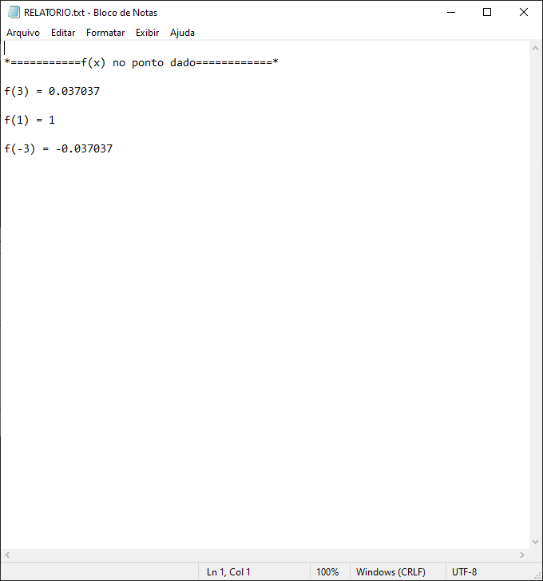
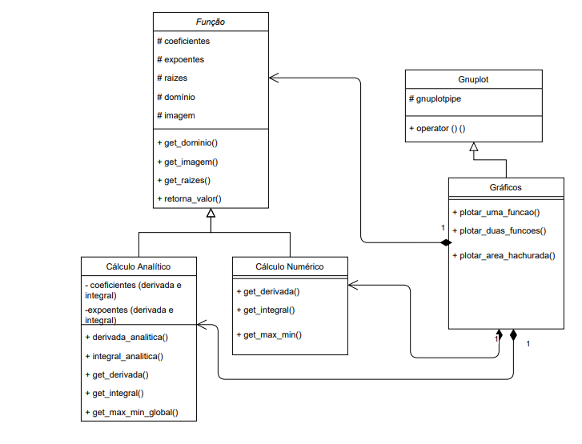

<a>
    
</a>


<h1 align = "center"> Projeto Final - INF112 </h1>


<h2 align = "center"> Uma aplicação para ajudar alunos de Cálculo I </h2>


## Índice

- [Funções](#Funções)
- [Funcionamento](#Funcionamento)
    - [Pré-requisitos](#Pré-requisitos)
    - [Entrada por arquivos](#Entrada_por_arquivos)
- [Exemplos](#Exemplos)
- [Lista de Exceções](#Lista-de-Exceções)
- [FAQ](#FAQ)
- [Responsáveis](#Responsáveis)
- [CRC](#CRC)
- [Diagrama de Classes](#Diagrama_de_classes)
- [Links Úteis](#Links-Úteis)


## Funções
- Determinar domínio e imagem da função 
- Determinar <code> f(x0)</code> dado <code> x0 </code>
- Determinar derivada e integral da função
- Esboçar gráficos

## Funcionamento
### Pré-requisitos 🔥

Antes de começar, você vai precisar ter instalado em sua máquina:
- [Gnuplot](http://www.gnuplot.info/download.html)  

### Entrada por arquivos 🧾

Nosso programa utiliza entrada e saída por texto para facilitar sua compreensão!

Para adicionar uma função que você deseja estudar, primeiro deve abrir o arquivo <code>INPUT.txt</code> e seguir os passos dentro dele. 

Assim que completo, salve-o e execute a aplicação em seu terminal. Volte para o diretório em que está o código e lá você encontrará um arquivo <code>RELATORIO.txt</code> contendo todas as informações que você deseja sobre a sua função de estudo!!


## Exemplo

3. Função de exemplo: _x^-3_


<a href="https://github.com/INF112-Programacao2/20202-team-6"></a>
<span> Arquivo INPUT.txt </span>


<a href="https://github.com/INF112-Programacao2/20202-team-6"></a>
<span> Aquivo output.jpg </span>

<a href="https://github.com/INF112-Programacao2/20202-team-6"></a>
<span> Arquivo RELATORIO.txt </span>


## Lista de Exceções

❌ Entrada inválida : Quando você coloca uma função que o programa não aceita

❌ Coeficiente inválido : Quando ocorre uma divisão por 0, ou seja, uma indeterminação

❌  

## FAQ
### ✔️ Como devo escrever minha função?
No momento, esperamos funções _polinômiais_. Então:
- <code>Ax</code> indica um monômio
- Utilize <code>x </code> para a variável incógnita.
- Para elevar expoentes utilize <code> ^</code>.                       Ex: _3x^2_
- Coeficientes podem ser do tipo <code> A</code> ou <code> A/B</code>. Ex: _5x_ ou _5/9x_
- Expoentes podem ser do tipo <code> C</code> ou <code> (C/D)</code>.  Ex: _x^5_ ou _x^(5/9)_
- Exemplo de entrada: _2/3x^3 - 12x^(6/3) + 2x - 81/2_.

### ✔️ Posso colocar qualquer tipo de função?
Por enquato a entrada está limitada a somente com _polinômios_ e funcções com _raizes_ e _expoentes negativos_, mas estamos trabalhando para adicionar outros tipos de funções!

### ✔️ Como calcula a derivada numérica?
Utilizamos o método das diferenças finitas:  


Em código, temos:

```c++
      double dfx0;

      double h = 0.0001;
      double fmais = retorna_valor(ponto + h); 
      double fmenos = retorna_valor(ponto - h);

      dfx0 = (fmais - fmenos)/(2.*h);

      return dfx0;
```
### ✔️ Como funciona a expressão ?

Com a biblioteca <code>regex</code> nós comparamos a entrada com a Expressão Regular r(), se houver uma correspondência dizemos que é uma Match. Quem determina todas as Matches é a função <code>sregex_interator</code> pos e com ela podemos guardar os valores que queremos, pois eles são justamente o seu retorno!

Nossa expressão regular é: 
```c++
[+-]?\\d*(?:\\/(\\d+))?)(?:x(?:\\^(?:\\(?(\\-?\\d+)(?:\\/(\\d+)\\))?)?)?)?
```

[Aqui](https://github.com/INF112-Programacao2/20202-team-6/blob/master/Readme/RegEx_e_Matches.txt) temos uma explicação mais detalhada do nosso trabalho com as expressões regulares!


## Responsáveis
- [Caio](https://github.com/caio-rondow) 
- [Gabriel Bezerra](https://github.com/GdSBezerra)
- [Olavo Barros](https://github.com/Olavo-B)
- [Vitor Moura](https://github.com/vitormoura11)

## CRC

| Classe: Funcao |  |
|-|-|
| Responsabilidade | Colaboração |
|   1.Atributos: Saber os coeficientes; Saber os expoentes; Saber o tipo; Saber domínio e imagem; Saber as raízes;           2.Métodos: Determinar o domínio e imagem; Determinar um f(x0); Determinar o gráfico de f e pontos; |   Gráfico; |

| Classe: Calculo_Numerico |  |
|-|-|
| Responsabilidade | Colaboração |
|   1.Atributos: Saber a derivada; Saber integral definida; e Saber o máximo e mínimo.      2.Métodos:  Determinar a aproximação a derivada em ponto ; Determinar a integral definida; Determinar máximo e mínimo em um determinado trecho do domínio; e Determinar o gráfico da reta tangente e área hachurada. |   Grafico; Funcao. |

| Classe: Calculo_Analitico |  |
|-|-|
| Responsabilidade | Colaboração |
|   1.Atributos: Saber os coeficientes da derivada e integral; Saber os expoentes da derivada e integral; Saber a derivada; Saber integral definida; e Saber o máximo e mínimo. 2.Métodos: Determinar a derivada analítica de f; Determinar um f’(x0); [polimorfismo] Determinar integral analítica de f; Determinar a integral de f em um ponto x0; [polimorfismo] Determinar máximo e mínimo global; Determinar o gráfico da reta tangente e área hachurada; |   Grafico; Funcao. |

| Classe: Grafico |  |
|-|-|
| Responsabilidade | Colaboração |
|   1.Atributos: Saber os coeficientes da derivada e integral; Saber os expoentes da derivada e integral; Saber a derivada; Saber integral definida; e Saber o máximo e mínimo.    2.Métodos:  Plotar um gráfico de funções ; Plotar um gráfico de duas funções; Plotar um gráfico com área hachurada  |   Funcao; Calculo_numerico; Calculo_Analitico. |

## Diagrama de Classes

<a href="https://github.com/INF112-Programacao2/20202-team-6"></a>

## Links Úteis
- [gnuplot](http://www.gnuplot.info/) : ferramenta para plotagem dos gráficos;
- [Diferenciação numérica](https://pt.wikipedia.org/wiki/Diferencia%C3%A7%C3%A3o_num%C3%A9rica#:~:text=Na%20an%C3%A1lise%20num%C3%A9rica%2C%20diferencia%C3%A7%C3%A3o%20num%C3%A9rica,outros%20conhecimentos%20sobre%20a%20fun%C3%A7%C3%A3o.) : como calculamos a derivada númerica
- [Expressão Regular "Regex"](https://pt.wikipedia.org/wiki/Express%C3%A3o_regular) : como salvamos os valores relevantes das funções
